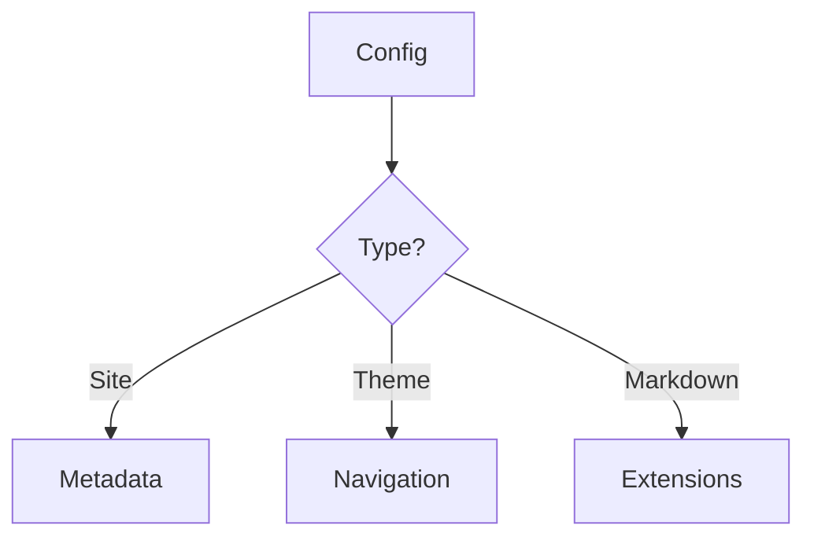

# Configuration Guide

## VitePress Configuration

The main configuration file is located at `.vitepress/config.ts`. Here you can customize:

- Site metadata
- Navigation
- Sidebar
- Markdown options
- Theme customization

## Mermaid Configuration

Mermaid diagrams are pre-configured and ready to use. Example:

## TypeScript Configuration

TypeScript is configured in `tsconfig.json` with:
- ESM modules
- Strict type checking
- VitePress type definitions
