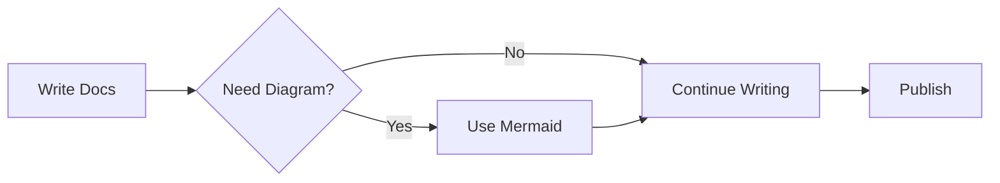

# Guide

This guide will help you understand how to use this documentation template effectively.

## Features

- **Mermaid Support**: Create diagrams directly in markdown
- **Route Validation**: Ensure all navigation links are valid
- **TypeScript**: Full TypeScript support for configuration
- **Modern Development**: Uses pnpm and Vite for fast development

## Example Mermaid Diagram

Here's a simple flowchart:

## Navigation Structure

The template comes with a pre-configured navigation structure that you can easily customize in `.vitepress/config.ts`.
