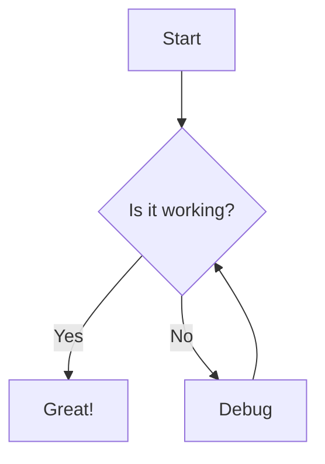

# VitePress Documentation Template

Welcome to the VitePress Documentation Template! This template comes with:

- ✅ Mermaid diagram support
- ✅ Automatic route validation
- ✅ TypeScript configuration
- ✅ Clean, organized structure

## Getting Started

1. Clone this repository
2. Install dependencies:
   ```bash
   pnpm install
   ```
3. Start the development server:
   ```bash
   pnpm docs:dev
   ```

## Features

### Mermaid Diagrams



### Route Validation

All routes in the navigation and sidebar are automatically validated to ensure they point to existing files. Run the tests:

```bash
pnpm test
```

## Project Structure

```
.
├── docs/
│   ├── .vitepress/
│   │   └── config.ts
│   ├── guide/
│   │   └── index.md
│   ├── examples/
│   │   └── index.md
│   └── index.md
├── tests/
│   └── route-validation.test.ts
├── package.json
└── tsconfig.json
```
